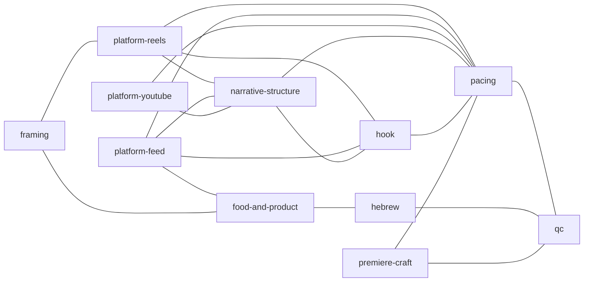

# Agents

צוות המומחים המקומיים של [[Premier Edit]]. **מומחה הוא לא קריאה למודל** — הוא
מודול ידע ב-`lib/experts/` שמזין את הקריאות שכבר קיימות. זו ההחלטה שמאפשרת
לצוות לגדול בלי שמספר הקריאות ל-API יגדל איתו: להוסיף מומחה מוסיף טקסט
לפרומפט קיים, לא קריאה חדשה.

הקובץ הזה נוצר אוטומטית מ-`lib/experts/index.ts` דרך
`npm run generate:agent-notes`. אל תערוך אותו ביד — ערוך את המומחה בקוד
והרץ מחדש.

11 מומחים, 19 קשרים.

## לפי שלב

### תמלול

- [[hebrew\|מומחה עברית]] — מכיר את מבנה העברית (תחיליות, RTL) ואת נקודות הכשל המוכחות של התמלול המקומי על החומר של הפרויקט הזה.

### ראייה

- [[framing\|מומחה קומפוזיציה]] — מגדיר את אוצר המילים של סוגי הצילום ומה נחשב שוט שאפשר להשתמש בו — מזין את שלב הראייה.
- [[food-and-product\|מומחה אוכל ומוצר]] — יודע אילו רגעים מוכרים מנה או מוצר — הרגע שבו זה נראה הכי טוב, ולא הרגע שבו מדברים עליו.

### בחירת תוכן

- [[platform-reels\|מומחה ריל / טיקטוק]] — נורמות של וידאו אנכי קצר — חלון נטישה, אורכים שעובדים, ולופ שסוגר את הסרטון על עצמו.
- [[platform-feed\|מומחה פוסט פיד]] — נורמות של סרטון פיד באורך בינוני — מחזיק תשומת לב לאורך זמן, עם התקדמות שנשארת ברורה.
- [[platform-youtube\|מומחה יוטיוב ארוך]] — נורמות של תוכן ארוך — נשימה, שימור צופים לאורך זמן, ומבנה שמחזיק כמה דקות ולא כמה שניות.
- [[narrative-structure\|מומחה מבנה סיפורי]] — בוחר מבנה בּיטים מוכר ליעד, ומוודא שכל ביט מאויש ושהקאט נגמר בסגירה ולא באמצע משפט.
- [[hook\|מומחה הוק]] — אחראי על 1-3 השניות הראשונות — בוחר סוג פתיחה מתוך רשימה מוכרת ופוסל פתיחות שמאבדות צופים.
- [[pacing\|מומחה קצב]] — קובע כמה רגעים צריכים להיות בקאט ובאיזה אורך, ובודק דטרמיניסטית שהקצב לא אחיד מדי או איטי מדי.
- [[food-and-product\|מומחה אוכל ומוצר]] — יודע אילו רגעים מוכרים מנה או מוצר — הרגע שבו זה נראה הכי טוב, ולא הרגע שבו מדברים עליו.
- [[hebrew\|מומחה עברית]] — מכיר את מבנה העברית (תחיליות, RTL) ואת נקודות הכשל המוכחות של התמלול המקומי על החומר של הפרויקט הזה.
- [[premiere-craft\|מומחה פרמיר]] — יודע מה שכבת הביצוע בפרמיר באמת יכולה לעשות ומה נשאר ידני — ושומר על גבול האוטומציה במקום להרחיב אותו.

### בקרת איכות

- [[pacing\|מומחה קצב]] — קובע כמה רגעים צריכים להיות בקאט ובאיזה אורך, ובודק דטרמיניסטית שהקצב לא אחיד מדי או איטי מדי.
- [[qc\|מומחה בקרת איכות]] — בודק את הקאט הגמור בדיקות דטרמיניסטיות — זמנים תקינים, אורך מול היעד, jump cuts וקצב. בלי מודל בכלל.

### ביצוע בפרמיר

- [[premiere-craft\|מומחה פרמיר]] — יודע מה שכבת הביצוע בפרמיר באמת יכולה לעשות ומה נשאר ידני — ושומר על גבול האוטומציה במקום להרחיב אותו.

## מפת הקשרים

## למה זה קיים

לפני השכבה הזו כל הידע העריכתי ישב בקובץ אחד, `lib/editing/social-guidelines.ts`,
שנשלח כמו שהוא לכל שלושת פרופילי הפלט. הוא הורה למודל לכוון ל-15-20 שניות
ולהימנע מ-30-40 שניות **גם כשהיעד היה יוטיוב ארוך של כמה דקות** — כלומר הנחיה
שגויה בשני שלישים מהמקרים. ראה [[Decisions and Open Questions]].
